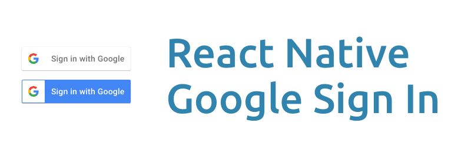
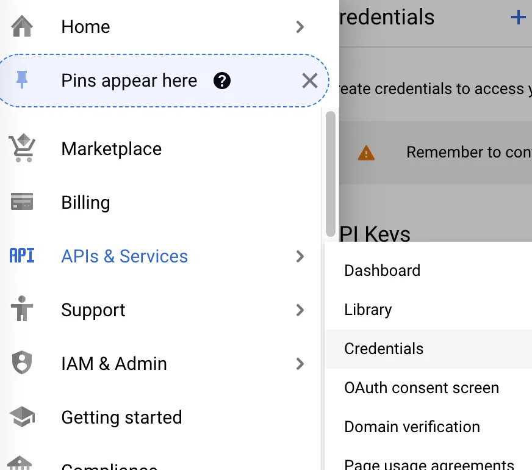
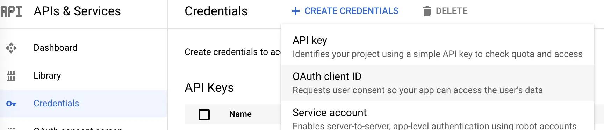
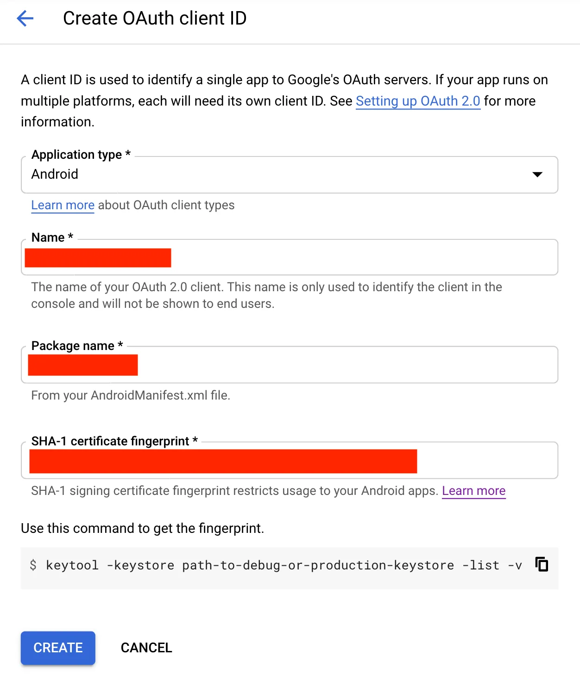

<h1 align="center">React Native Gmail Sign In</h1>

<div align="center">
<!-- Gmail Account -->
<a href="mailto:jayed.swe@gmail.com">

</a>
<a href="tel:+8801987132107">

<a href="#" target="_blank">

</a>
<a href="https://www.facebook.com/jibon969" target="_blank">


<a href="https://www.linkedin.com/in/jibon969/" target="_blank">

</a>
<a href="https://github.com/jibon969" target="_blank">

</a>
</div>

<hr/>

<div align="center">
        <a href="https://reactnative.dev/" target="_blank">Documentation
        </a>
        |
        <a href="https://blog.deversity.com/2021/10/combining-drawer-tab-and-stack.html" target="_blank">Combining Navigators </a>
        |
        <a href="https://medium.com/enappd/firebase-push-notifications-in-react-native-apps-d9f60726ce9c" target="_blank">Push notifications</a>
        |
        <a href="https://www.notjust.dev/blog/2022-06-30-how-to-publish-react-native-cli-app-to-google-play-store" target="_blank">Publish Android</a>
        |
        <a href="https://www.notjust.dev/blog/2022-06-29-how-to-publish-react-native-cli-app-to-apple-app-store" target="_blank">Publish iOS</a>
        |
        <a href="https://ibjects.medium.com/google-signin-tutorial-for-react-native-81a57fb67b18" target="_blank">Google SignIn</a>
        |
        <a href="#" target="_blank">Learn More</a>
</div>
<hr/>

### For Android

```bash
# Create new project
npx react-native@0.72.6 init SocialLoginReactNative --version 0.72.6

# Go to Project directory
cd SocialLoginReactNative

# Run this project
npx react-native run-android
```

### Step 2 : Create an SHA-1 fingerprint

```bash
# cd android
cd android

# Generating the required Keys
keytool -keystore app/debug.keystore -list -v
Enter keystore password: android

# Copy the SHA1 and paste the SHA-1 key in the Google Cloud Console ad click on CREATE. 
Certificate fingerprints:
	 SHA1: 5E:8F:16:06:2E:A3:CD:2C:4A:0D:54:78:76:BA:A6:F3:8C:AB:F6:25
    
# Need image also
```


### Step 3 : Generating the required Keys

```bash
# Go to https://console.cloud.google.com/ and create a New Project

# Click on CREATE CREDENTIALS → OAuth client ID and this time from Application type select Android.
```



### Step 4 : Click on CREATE CREDENTIALS → OAuth client ID


### Step 5 : CREATE → OAuth client ID
```bash
# Past this code here SHA-1 certificate fingerprint
5E:8F:16:06:2E:A3:CD:2C:4A:0D:54:78:76:BA:A6:F3:8C:AB:F6:25

# you can also find out package name > android > app > build.gradle > namespace
```


### Step 6 : Implementing Google Sign In for React Native App
```bash
# install package
yarn add @react-native-google-signin/google-signin
```

### Step 7 : Added this code here
```bash
# install package
yarn add @react-native-google-signin/google-signin


```


